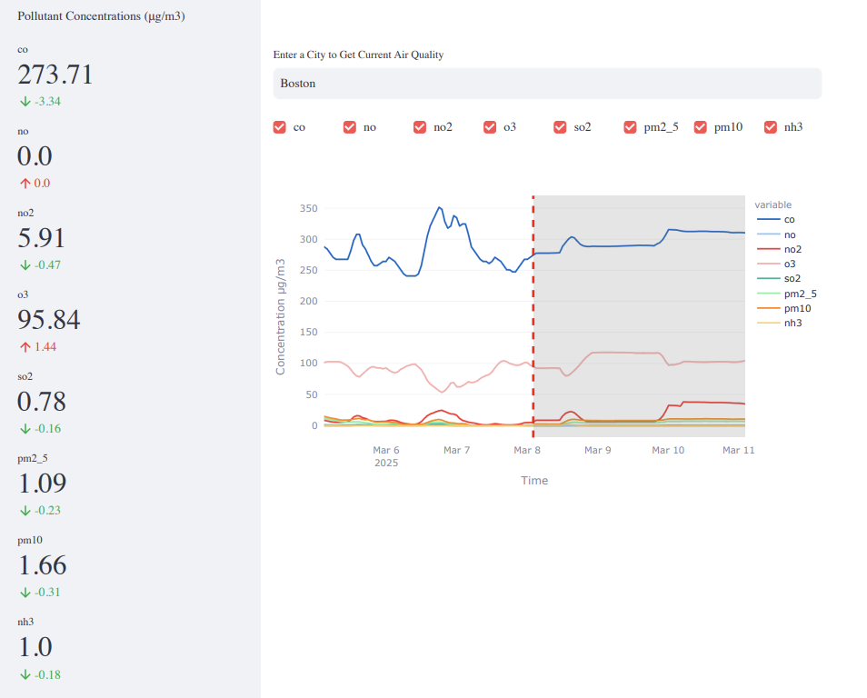

<h1>Air Quality App</h1>

<h2>LSTM Prediction Application</h2>

## Overview:

This application is deployed [here](https://air-quality-app-wr4z.onrender.com)

This project implements an air quality prediction system using an LSTM (Long Short-Term Memory) neural network to forecast air pollution levels. The system is designed to dynamically adapt and improve over time by integrating historical data and real-time updates pulled from the OpenWeatherMap API. The backend is powered by TensorFlow, while the system is deployed and hosted on AWS, with a user interface built using Streamlit.

## Key Features:
+ Predictive Modeling: Developed and trained an LSTM model in TensorFlow to predict future air quality trends based on historical data.
+ Real-Time Data Integration: Integrated OpenWeatherMap API to collect live air quality data from multiple cities, ensuring real-time model updates.
+ Automated Data Pipeline: Set up a MySQL database on AWS to store and manage historical and real-time air quality data. The system is designed to automatically retrain the model at regular intervals to incorporate new data and improve predictions.
+ Web Application: Created a user-friendly web application using Streamlit to visualize air quality data and predictions, offering easy access for users to track air quality trends in their cities.
+ Scalable Infrastructure: Deployed on AWS for reliable, scalable data storage and model updates.

## Skills & Technologies Used:
+ Deep Learning: TensorFlow (LSTM model for time series forecasting)
+ API Integration: OpenWeatherMap API for real-time data
+ Database Management: MySQL (hosted on AWS for efficient data storage and querying)
+ Web Development: Streamlit (framework for building the web app interface)
+ Cloud Computing: AWS (for hosting MySQL database and deployment)
+ Data Handling: Pandas, NumPy (for data preprocessing and manipulation)
